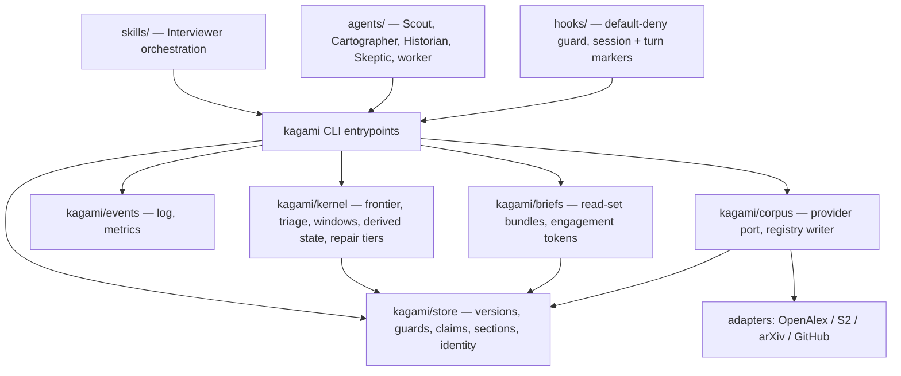

# Architecture Spine — KagamiOS v1

## Design Paradigm

**Hexagonal (ports-and-adapters) deterministic core, hosted as a Claude Code plugin.** The core (`kagami/`) is a pure-Python library exposing ports; every volatile dependency is an adapter behind a port: literature providers, the LLM harness itself (see AD-22), the elicitation surface, the filesystem store. Control flow is inverted relative to a classic app — the LLM harness (Claude Code skill + subagents) drives, and the core's job is to **refuse illegal outcomes and record everything**, not to orchestrate. Nickname used throughout: *gatekeeper kernel*.

Layer map:

- `kagami/store/` — artifact store, versioning, write-guards, staleness, section identity, entity-registry identity (the gate)
- `kagami/kernel/` — derived state, frontier, triage, question batching, generation windows, repair tiers (pure functions over store state)
- `kagami/events/` — event log append + derived metrics
- `kagami/corpus/` — paper cards, provider port + adapters (OpenAlex, Semantic Scholar, arXiv, GitHub); main writer of the entity registry
- `kagami/briefs/` — read-set-compliant context bundle rendering per (role, state, target)
- `skills/`, `agents/`, `hooks/` — the harness-facing shell; never contains state or rules

## Invariants & Rules

### AD-1 — Runtime shape: Claude Code plugin with a deterministic gatekeeper core `[ADOPTED]`

- **Binds:** all
- **Prevents:** enforcement-by-prompt-convention; a standalone app that abandons the BMAD ecosystem
- **Rule:** KagamiOS ships as a Claude Code plugin, co-installable with BMAD. All mechanical guarantees (write-guards, generation windows, ASK batching, versioning, event logging, staleness, derived state) are implemented in the Python core, never in prompts. Claude Code is the driver, never the kernel: no rule may exist only in a SKILL.md.

### AD-2 — The chokepoint: `kagami` entrypoints are the only sanctioned mutation path, enforced by default-deny `[ADOPTED]`

- **Binds:** all state (artifacts, ledger, event log, corpus, registry, profile, manifest)
- **Prevents:** two mutation paths with different validation; unvalidated state reaching the store; hook evasion via unenumerated Bash write vectors (`cp`, `sed -i`, `python -c`, heredocs, …)
- **Rule:** Every AI-originated state change goes through a `kagami` CLI entrypoint. The PreToolUse hook is **default-deny for any tool invocation whose arguments reference the output root** — `Write`, `Edit`, and every `Bash` command alike — with a single allow-pattern: the `kagami` invocation form (AD-23). Never an enumerated blocklist of write patterns. Each entrypoint validates against the schema registry, enforces window/guard/claim rules, appends its event, and echoes one-line JSON — the memlog.py contract, generalized.

### AD-3 — Provenance: data plane vs. control plane; out-of-band data-plane changes are candidate human edits

- **Binds:** store, provenance (FR-12, FR-19), `kagami scan`
- **Prevents:** AI writes laundered into human provenance; hand/git edits to control state accepted as intent; asking questions an edit already answered
- **Rule:** AD-3 applies only to **data-plane files** — `current.md` (the sole human edit surface, AD-6) and other declared human surfaces. `meta.yaml`, `manifest.yaml`, `events.jsonl`, `queue/`, the ledger record store, and lock/lease files are **control-plane: chokepoint-exclusive** — an out-of-band change to them is corruption, not intent: detected by hash at next entrypoint, refused as input, reported, and rebuilt from data-plane ground truth where derivable (P1). A data-plane change detected by `kagami scan` is a *candidate* human edit: it is attributed human when it occurred outside an active AI turn (turn boundaries recorded by hook events); a change appearing mid-AI-turn is quarantined `suspect` and flips no provenance and resolves no unknowns until the researcher confirms it with one keystroke at the next gate. Known accepted edge: git operations and formatters run by the researcher acquire human attribution — logged, revisitable.

### AD-4 — Roles are subagents with registered sessions; the orchestrating skill *is* the Interviewer

- **Binds:** FR-25..FR-29, FR-33/34 (read sets), FR-27 (Skeptic freshness)
- **Prevents:** role charters as vibes; context leakage between roles; content writes with fabricated role attribution; briefs keyed inconsistently with the spec's read-set table
- **Rule:** Named roles — Scout, Cartographer, Historian, Skeptic — plus a **`worker` drafting role parameterized by (state, target)** (dossier non-Evolution sections, Synthesis, Gap Register drafts) are subagent definitions with role-restricted tools (only Scout gets search tools). Role sessions are **registered with the chokepoint** via hook-driven `kagami session open/close` (a control-plane session table); `kagami brief <role> <state> <target>` renders the read-set-compliant context bundle — the read-set table in `docs-spec/07_runtime.md` §3 is the normative content of the brief renderer — and mints a **single-use engagement token** bound to (role, target). An artifact content submission must present a token whose session is open, role-matching, and unexpired, else refused. The main thread is the Interviewer: it schedules and asks; content it writes without a token is refused. Residual, accepted as detect-and-audit (AD-11): a live role citing its own valid token for off-charter content.

### AD-5 — Core is a standalone-capable library; harness bindings are adapters `[ADOPTED]`

- **Binds:** `kagami/` package layout, all harness-facing code
- **Prevents:** core logic importing anything Claude-Code-specific; a future CLI/runtime requiring a rewrite
- **Rule:** `kagami/` imports no harness API. The skill, hooks, and agent definitions call the core only through its CLI entrypoints. A future non-plugin runtime is an adapter over the same entrypoints. The standing proof is AD-25's scripted-driver test suite.

### AD-6 — Store layout: explicit immutable version files; `current.md` is the only human edit surface `[ADOPTED]`

- **Binds:** artifact store, FR-9..FR-14, FR-32, FR-33
- **Prevents:** version semantics depending on git state; history reconstruction from diffs; in-place human edits destroying pinned version content; summary/content drift
- **Rule:** Each artifact is a directory: immutable `vN.md` files (the chokepoint never rewrites an existing one; no one edits them), a mutable **`current.md`** — the materialized copy of the current accepted version and the *only* file humans edit — and `meta.yaml` (current pointer, status, pins, claims, section registry, content hashes; control-plane per AD-3). `kagami scan` diffs `current.md` against the latest version's recorded hash, mints `v(N+1).md` with touched spans `human-confirmed`, and advances the pointer — so integer-compare staleness fires on human edits exactly as on AI ones. Versions are monotonic integers owned by the chokepoint under the run lock (AD-15). The 5–10 line `summary` is regenerated **only at acceptance** and stored as part of that version (`kagami accept` requires it as validated input — AD-22); a full-text pull is a distinct logged event from a summary read.

### AD-7 — Literature providers behind one port; default is configuration `[ADOPTED]`

- **Binds:** `kagami/corpus/`, Scout
- **Prevents:** single-provider coupling; provider choice baked into call sites (OpenAlex's Feb-2026 pricing change is the live proof)
- **Rule:** One `LiteratureProvider` port (search, paper metadata, citation graph). OpenAlex and Semantic Scholar are peer adapters; arXiv and GitHub are complementary-source adapters. No call site names a provider; the default comes from `config.yaml`. Provider credentials come from **environment variables only, never `config.yaml`** (which lives in the user's project and may be committed).

### AD-8 — Single ASK scheduler, batch ≤ 5, enforced at the ledger

- **Binds:** FR-18, FR-21..FR-23, Question Ledger
- **Prevents:** parallel workers each interrogating the researcher; oversized batches
- **Rule:** `kagami ask` is the only entrypoint that creates researcher-facing questions. Worker-emitted unknowns land in `queue/`, never directly in front of the researcher. `kagami ask emit` refuses a batch over 5 and requires target + leverage class per question (E6 unprimed pair excepted); `kagami ask answer` writes the ledger entry (AD-17) and timestamps; `kagami ask revise` is the E5 revision path.

### AD-9 — Generation windows enforced by store refusal, keyed to per-cluster derived state

- **Binds:** FR-24, FR-46; v2 non-preclusion of FR-42/43/44
- **Prevents:** direction-shaped content before an accepted Gap Register; AI framing *drafted* before the unprimed answer is recorded; run-level window checks blocking legal Deepen parallelism
- **Rule:** The chokepoint refuses to create an artifact type before its generation-window state per the registry's window table (which includes Propose/Decide types from day one). **Windows key off the per-cluster derived state (AD-20's pure function), except the Candidate-Direction window, which keys off run-level Gap Register acceptance** — a dossier for cluster 1 while cluster 2 is still mapping is legal. Refused direction-shaped content is quarantined to `premature_ideas/`, never discarded. The Frame draft artifact cannot be written until the Frame unprimed ledger entry exists — *artifact creation* ordering is impossible to violate; *conversational display* before the ledger entry is detect-and-audit (AD-11's honest-gap list).

### AD-10 — Parallel writers claim sections; claims are lease-bound

- **Binds:** FR-11, Deepen parallelism (FR-3, one worker per cluster)
- **Prevents:** two workers writing the same section; merge ambiguity; crashed workers wedging sections forever
- **Rule:** A write names the section IDs (AD-19) it targets; `meta.yaml` records active claims; the chokepoint — under the run lock (AD-15) — rejects a write to a section claimed by another live worker. A claim carries the session lease id (AD-15) and expires with it; expired claims are reaped at run open. Sequential execution is a valid degraded mode — parallelism is an optimization, never a correctness requirement.

### AD-11 — Event log: append-only JSONL, written only by the core; the honest-gap register

- **Binds:** FR-29, FR-36..FR-37, FR-5
- **Prevents:** runtime behavior reading telemetry; unlogged mutations; overclaimed guarantees
- **Rule:** Every chokepoint entrypoint appends its event (one JSON object per line, single `O_APPEND` write, `family` per the spec's ten families) as part of the same locked operation. An `llm_call` event carries `role`, `operation_class`, `model_tier`, token counts, and cache-hit — without operation-class tagging the layer-2 token ledger is uncomputable later. The core exposes no read API over `events.jsonl`; the invariant "a run with its trace deleted behaves identically" is a standing test (AD-25). The one sanctioned read exception (FR-5 gate loosening) consumes only `kagami metrics` derived aggregates, never raw events, effective only on researcher approval. **Honest-gap register (accepted, detect-and-audit, logged not hidden):** main-thread token/prompt accounting incomplete; frontier obedience; conversational display before ledger entry (AD-9); off-charter content under a valid engagement token (AD-4); harness-side reads of the log file by subagents.

### AD-12 — Dispatch is per *operation class*; models, tiers, and researcher-owned settings live in config

- **Binds:** agent definitions, dispatch decisions, `config.yaml`, `schemas/dispatch.yaml`
- **Prevents:** hard-coded model names rotting; per-role flattening of the spec's operation→tier table; researcher-owned choices requiring code changes
- **Rule:** The **static, human-maintained dispatch table** (`schemas/dispatch.yaml`, versioned with the registry) maps operation classes to tiers: deterministic / deterministic-ML / cheap-model / frontier-model, per `docs-spec/07_runtime.md` §5. `config.yaml` maps tiers to concrete models. Subagent `model` frontmatter is static, so the skill resolves the model **at launch time** from config + dispatch table. Default literature provider, output roots, and the privacy/sharing flag (default **off**, FR-39) are also `config.yaml`. Code refers to operation classes, tiers, and ports — never to concrete model or provider names.

### AD-13 — User data lives in the user's project, never in the plugin install

- **Binds:** all stores
- **Prevents:** researcher-owned data trapped in a plugin directory; plugin upgrades touching user state
- **Rule:** Runs (`runs/<run-id>/`), corpus cache, entity registry, and researcher profile live under the configurable output root in the user's project. The plugin directory contains only code, schemas, skills, agents, hooks. Deleting the plugin loses no user data; deleting the output root loses no plugin.

### AD-14 — Non-preclusion is a schema-registry obligation — including the infrastructure stores and observability commitments

- **Binds:** schema registry, state-machine enum, window table, ledger schema, event schema; FR-47 non-preclusion
- **Prevents:** v1 shortcuts that make Propose/Decide — or the v2+ Design Audit loop — a breaking change
- **Rule:** The state enum, artifact schema registry, and generation-window table ship complete (all six states + Decide, all eleven artifact types) from v1; the registry also governs the **infrastructure stores** (ledger entry, run manifest, event families). Three things are locked from run 1 because they cannot be retrofitted: (a) the stable **question-class key** (leverage × state × form) in every ledger entry; (b) **run-id outcome-join** fields for late-arriving quality data; (c) the **`audit_exempt: permanent`** flag on constitutive-triad fields and the two E6 unprimed question classes (FR-47). MVP omits the *flows* for Propose/Decide, not their types.

### AD-15 — Chokepoint serialization, single-writer lease, and crash consistency

- **Binds:** every mutating entrypoint; all locks; FR-32 (ID minting)
- **Prevents:** claim-check races; duplicate version integers; lost `meta.yaml` updates; torn JSONL lines; two sessions corrupting one run; wedged state after a crash
- **Rule:** Every mutating entrypoint acquires an exclusive advisory lock (`flock`, bounded wait, `{"ok": false, "error": "busy"}` on timeout) on `runs/<run-id>/.lock` for its full read-validate-write-append span; version integers, IDs, and claims are decided only under it. **One writer session per run:** `kagami run open` takes a lease file (holder id + heartbeat); a second session gets read-only access or must explicitly break a stale lease. Fixed write order per operation — version file → meta → event — all via temp-file + fsync + atomic rename; JSONL appends are single `write()` calls under `O_APPEND`. `kagami run open` runs a consistency repair that detects and completes or rolls back torn operations and reaps expired claims. Cross-run stores carry their own locks (AD-18). Store mutation is serial by construction; parallelism (AD-10) is parallel *LLM work*.

### AD-16 — Scan-before-write: human edits always win over queued AI writes

- **Binds:** every artifact-mutating entrypoint; FR-12, FR-19; `docs-spec/07_runtime.md` §2
- **Prevents:** a queued AI regeneration silently superseding an unscanned human edit — the highest-bandwidth elicitation channel destroyed by a race
- **Rule:** Inside the same locked operation (AD-15), every entrypoint targeting an artifact runs the `current.md` hash check *first*. Detected human edits are processed first (spans → `human-confirmed`, unknowns resolved, `v(N+1)` minted per AD-6); then the AI write is re-validated, and if it overlaps any human-confirmed span it is **refused and re-emitted as a proposed-diff artifact** — never applied. "Human edits always win" is a store refusal, not a scheduler courtesy.

### AD-17 — The Question Ledger is a schema-governed record store; `ledger.md` is a render

- **Binds:** FR-18, FR-22, AD-8; `docs-spec/05_elicitation.md` §5
- **Prevents:** a prose ledger the staleness engine can't compute over; append-only colliding with `consumed_by`/`superseded_by` stamping; researcher hand-edits gutting the trace
- **Rule:** Ledger entries are structured records (`ledger/q-NNN.yaml`) validated against the registry's ledger schema, field-for-field per 05 §5 including the question-class key (AD-14). Entry *versions* are immutable (`q-NNN@v2` on revision via `kagami ask revise`); `consumed_by` stamps live in a mutable per-entry meta section, mirroring `meta.yaml`. `elicited_from` pins `q-id@version`, so answer revisions propagate staleness through the standard integer compare. `ledger.md` is a derived, regenerable human view — control-plane, not an edit surface.

### AD-18 — Cross-run store contracts

- **Binds:** `corpus/`, `registry/`, `profile/`; FR-14, FR-32
- **Prevents:** pin-consuming code meeting a versionless profile; entity/paper ID collisions across runs; unmigratable cache shapes
- **Rule:** (a) `profile/researcher-profile/` is a normal AD-6 artifact directory (versions, `current.md`, `meta.yaml`); everything pinning the profile pins a version. (b) `corpus/` and `registry/` are **derived and unversioned** with **content-derived IDs** — `ppr-` from a canonical bibliographic key (DOI/arXiv-ID hash), `ent-` from a canonical entity key — so concurrent minting converges instead of colliding; every card/record carries `schema_version`. (c) Each cross-run store has its own lock (AD-15 mechanics). Identity semantics live in `kagami/store/`; `kagami/corpus/` is the registry's main writer.

### AD-19 — Section identity: opaque, minted once, registered, never content-derived

- **Binds:** FR-11, AD-10 claims, repair, briefs, trace addressing
- **Prevents:** heading-slug IDs orphaning claims, per-section status, and pinned deps on every rename
- **Rule:** Section IDs are opaque (`sec-` + chokepoint-minted suffix), created once at section creation, registered in `meta.yaml` (`sections: [{id, title}]`), and never derived from content or headings. A write must reference existing IDs or explicitly create/retire IDs — retirement is a logged event and releases claims; a version that silently drops a registered live section is refused. Titles are mutable labels; identity is the ID, and it survives regeneration.

### AD-20 — Derived state is the kernel's pure function; the manifest is a cache plus the non-derivable facts

- **Binds:** FR-3, AD-9 guards, `manifest.yaml`
- **Prevents:** two authorities for the input to window/gate refusals; guard decisions read from a stale or hand-damaged file
- **Rule:** Per-cluster derived state is *definitionally* `kagami/kernel/`'s pure function over store + ledger. `manifest.yaml`'s state fields are a cache, recomputed by every mutating entrypoint and **never read for a guard decision** — guards call the function. The manifest's authoritative contents are only what is not derivable: run id, rooting Intuition Note reference, depth budgets, and monitoring config (per `docs-spec/04_artifacts.md` §3).

### AD-21 — Repair pipeline: tiered, frontier-triggered, sectional

- **Binds:** FR-13, FR-35; `docs-spec/07_runtime.md` §4
- **Prevents:** whole-artifact regeneration on every staleness mark; repair invented differently per unit; silent overwrites of human spans
- **Rule:** Repair runs only when the frontier needs the stale artifact (never eagerly): Tier 0 — deterministic dependency check (no model call); Tier 1 — cheap-model plausibility check per failing edge (via AD-22's protocol); Tier 2 — regenerate only the failing section IDs. Human-touched spans get proposed diffs only (AD-16). Tier assignment is dispatch-table data (AD-12).

### AD-22 — Core operations needing model output use one protocol: validated input or `needs_llm` work item

- **Binds:** `kagami accept` (summaries), repair Tier 1, paper-card extraction; the "LLM harness as adapter" port
- **Prevents:** three units inventing three different core↔model seams
- **Rule:** Chokepoint entrypoints never invoke models. An operation requiring model output either (a) demands it as a schema-validated input argument (`kagami accept` refuses without a conforming summary for that version), or (b) returns a typed `needs_llm` work item in its JSON echo — operation class, brief reference, expected schema — which the harness fulfills and submits through a validating entrypoint. No third pattern.

### AD-23 — Installation and schema migration

- **Binds:** every invocation; plugin upgrades; old runs
- **Prevents:** each entrypoint guessing how `kagami` resolves from an arbitrary cwd; an upgraded registry silently mutating old-schema runs
- **Rule:** The plugin ships a `pyproject.toml`; every invocation is `uv run --project ${CLAUDE_PLUGIN_ROOT} kagami <cmd>` (hooks and the skill own resolving the plugin root); uv materializes dependencies on first run. Every write stamps `schema_registry_version` into `meta.yaml`/`manifest.yaml`; the chokepoint **refuses to mutate** a run written under a *newer* registry, and reads older-schema runs read-only via the versioned registry (FR-30). `kagami migrate` — human-invoked, logged, minting new versions, never editing `vN.md` in place — is the only path that rewrites old runs.

### AD-24 — Monitoring is a sweep, not a daemon

- **Binds:** FR-7 (Dormant, v1-reachable); FR-8 non-preclusion
- **Prevents:** one unit assuming a background process a plugin cannot have, another assuming none
- **Rule:** `kagami monitor` executes the manifest's monitoring config as a sweep at run open / skill activation. Dormant reopening therefore happens **at next session, never asynchronously** — an explicit narrowing of FR-7's "automatically," recorded here and in the memlog (PRD wording amendment recommended, pending researcher approval). v2 post-decision monitoring (FR-8) reuses the same sweep mechanism.

### AD-25 — Testing: the core is verified at the CLI boundary, harness-free

- **Binds:** `kagami/` test suite; hooks; AD-5's standalone claim
- **Prevents:** per-story invention of test strategy; AD-5 degrading into an aspiration
- **Rule:** The core is tested at the entrypoint boundary against the one-line-JSON contract with a scripted driver replacing the harness — this suite is the standing proof of AD-5. A golden minimal-run fixture exercises windows, guards, staleness, E6 ordering, scan-before-write, and lease/crash recovery. The events-deletion invariance test (AD-11) is part of it. Hooks are tested against recorded PreToolUse payloads. Anything finer is story-level.

### Dependency direction



Arrows mean "may depend on." The core packages never import upward (AD-5); `store` imports nothing else in the diagram.

## Consistency Conventions

| Concern | Convention |
| --- | --- |
| IDs | One ID space, prefix-typed: `run-`, `art-`, `sec-`, `q-`, `ppr-`, `ent-`, `evt-`. Minted only by the chokepoint under its lock (AD-15); `ppr-`/`ent-` are content-derived (AD-18). |
| Artifact type slugs | kebab-case, exactly matching schema registry filenames: `intuition-note`, `inquiry-frame`, `field-map`, `cluster-dossier`, `landscape-synthesis`, `gap-register`, `confidence-checklist`, `researcher-profile`, `candidate-direction`, `direction-decision`, `dissolution-memo` |
| Dates | ISO-8601 UTC everywhere (frontmatter, ledger, events) |
| Script I/O | Every `kagami` entrypoint echoes one-line JSON `{"ok": bool, ...}` on stdout; errors are `{"ok": false, "error": "..."}`; model-needing operations may return `needs_llm` items (AD-22) |
| Event log | JSONL, one event per line, `family` ∈ the spec's ten families; `llm_call` events carry `role`, `operation_class`, `model_tier`, tokens, cache-hit (AD-11) |
| Invocation | Always `uv run --project ${CLAUDE_PLUGIN_ROOT} kagami <cmd>` (AD-23); no bare `python` |
| Human edit surface | `current.md` only (AD-6); `vN.md` and all control-plane files are never hand-edited |
| Credentials | Environment variables only; never `config.yaml` (AD-7) |
| YAML files | `meta.yaml`, `manifest.yaml`, ledger records are machine-owned and comment-free (PyYAML round-trip constraint); the core never rewrites `config.yaml` |
| Vocabulary | PRD Glossary terms verbatim in code identifiers, schema names, and docs — no synonyms |

## Stack

*Seed — verified current 2026-07-02/03; the code owns this once it exists.*

| Name | Version / status |
| --- | --- |
| Python | ≥ 3.12 (3.14.x current) |
| uv | current (toolchain shared with BMAD); plugin ships `pyproject.toml`, invoked via `--project` (AD-23) |
| pydantic | 2.13.x (schema registry validation) |
| PyYAML | 6.x — cannot round-trip comments; acceptable per the machine-owned-YAML convention above |
| Claude Code plugin platform | plugins ship skills + agents + hooks (verified); PreToolUse can deny (exit-2 / `permissionDecision: "deny"`); subagent `model` frontmatter static → launch-time resolution per AD-12; plugin-shipped subagents ignore `hooks`/`mcpServers` frontmatter (plugin-level hooks unaffected) |
| OpenAlex API | usage-based pricing since Feb 2026; **API key now mandatory for all requests** (free key, ~$1/day allowance) — adapter needs key config (env var) from day one |
| Semantic Scholar API | free; keyless = shared global pool (throttled under load), free key = dedicated ~1 RPS introductory tier |
| arXiv API | free; ~1 req/3s etiquette, 429 tightening reported since Feb 2026 — backoff required in adapter |
| GitHub search API | token effectively required; ~30 req/min search limit |

## Structural Seed

Plugin tree:

```text
kagamios/                          # plugin root (code only — AD-13)
  .claude-plugin/plugin.json
  pyproject.toml                   # AD-23: uv project for the core
  skills/kagami-discovery/SKILL.md # the Interviewer (AD-4)
  agents/                          # scout.md, cartographer.md, historian.md, skeptic.md, worker.md
  hooks/                           # default-deny guard, session/turn markers (AD-2, AD-3, AD-4)
  kagami/                          # deterministic core (AD-5): store/ kernel/ events/ corpus/ briefs/
  schemas/                         # versioned YAML registry: 11 artifact types, infrastructure stores,
                                   #   window table, dispatch.yaml (AD-12, AD-14)
```

User project tree (under the configurable output root):

```text
_kagami-output/
  config.yaml                      # provider default, tier→model map, output roots, privacy flag (AD-12)
  runs/<run-id>/
    .lock / .lease                 # AD-15
    manifest.yaml                  # run id, rooting note ref, budgets, monitoring config + state cache (AD-20)
    artifacts/<type>/<art-id>/     # vN.md (immutable) + current.md (edit surface) + meta.yaml (AD-6)
    ledger/                        # q-NNN.yaml record store (AD-17); ledger.md = derived render
    events.jsonl                   # event log (AD-11)
    queue/                         # worker-emitted unknowns awaiting the ASK scheduler (AD-8)
    premature_ideas/               # generation-window quarantine (AD-9)
  corpus/                          # paper cards, cross-run, content-derived ppr- IDs (AD-18)
  registry/                        # entity registry, cross-run, content-derived ent- IDs (AD-18)
  profile/researcher-profile/      # AD-6-shaped artifact directory (AD-18)
```

## Capability → Architecture Map

| Capability (PRD) | Lives in | Governed by |
| --- | --- | --- |
| §4.1 State machine, loop-backs, waivers, terminals (FR-1..7) | `kernel/` derived-state + `manifest.yaml` + `events/` | AD-2, AD-14, AD-20 |
| §4.1 Dormant monitoring (FR-7) | `kagami monitor` sweep | AD-24 |
| §4.2 Artifact system (FR-9..16) | `store/` | AD-2, AD-3, AD-6, AD-10, AD-15, AD-16, AD-19 |
| §4.2 Repair (FR-13, FR-35) | `kernel/` repair tiers | AD-21, AD-22, AD-16 |
| §4.3 Elicitation kernel (FR-17..24) | `kernel/` + `kagami ask` + `ledger/` + skill | AD-4, AD-8, AD-9, AD-17 |
| §4.4 Role contracts (FR-25..29) | `agents/` + `briefs/` + hooks + session table | AD-4, AD-12 |
| §4.5 Runtime contracts (FR-30..35) | `schemas/` + `store/` + `briefs/` | AD-2, AD-5, AD-6, AD-22, AD-23 |
| §4.6 Observability (FR-36, FR-37, FR-39; 38/40/41 deferred) | `events/` | AD-11, AD-13, AD-14 |
| §4.7 guardrails in-scope for v1 (FR-45 budgets, FR-46 windows) | `kernel/` + `manifest.yaml` | AD-9, AD-20 |
| Corpus / Scout search (FR-25) | `corpus/` + provider adapters | AD-7, AD-18 |
| v2 non-preclusion (FR-8, FR-42/43/44, FR-47) | `schemas/` window table + state enum + exemption flags | AD-14, AD-24 |

## Deferred

- **Local embedding index over paper cards** — **recorded deviation from `docs-spec/07_runtime.md` §5–§6** (which specifies corpus-tier hybrid retrieval including embeddings, and embeddings + graph communities as Map's partition mechanism), accepted by explicit researcher decision. Interim mechanism, fixed here so units don't diverge: candidate partitions derive from **citation-graph communities plus provider-side relevance/semantic search**, and FR-26's two structurally different cuts must be derivable from that pair. Revisit trigger: Scout/Cartographer demonstrably miss relevant clusters during dogfooding. (Artifact tier stays graph-only permanently — Standing Refusal, not a deferral.)
- **Propose/Decide flows** (FR-42/43/44, the Propose-side unprimed question, post-decision monitoring FR-8) — v2; types, windows, and exemption flags already ship per AD-14; FR-8 reuses AD-24's sweep.
- **Cross-run analytics store + Design Audit Report loop** (FR-38, FR-40, FR-41) — needs accumulated runs; PRD §7.2. The run-1 schema commitments that make this loop possible later are *not* deferred (AD-14). FR-39's content-stripping rules (event shapes/counts/classes travel; question text, artifact content, paper identities never) ride this deferral explicitly and bind any future sharing surface.
- **CLI / non-plugin runtime adapter** — enabled by AD-5, built only if the plugin-model downgrades (AD-11) prove unacceptable.
- **Prompt-cache prefix ordering, machine token budgets, stall surfacing, question-form experiments** (O2/O5, O6, O7, O8) — adoption triggers per PRD §7.2.
- **Provider failover/retry/backoff policy details** — a story-level decision inside the AD-7 port; rate-limit facts recorded in Stack.
- **Exact schema field lists per artifact type** — transcription from `docs-spec/04_artifacts.md` + `07_runtime.md` §1 at story time; the registry format, window table, ledger schema, and exemption flags are fixed here (AD-14), their contents are data.
- **Hook matcher syntax and deny-message text** — single-unit detail; the deny *semantics* (default-deny + allowlist) are AD-2, not deferrable.
- **`kagami migrate` mechanics** — the refusal rule and version stamping are AD-23; the migration implementation waits until a schema change exists to migrate.
