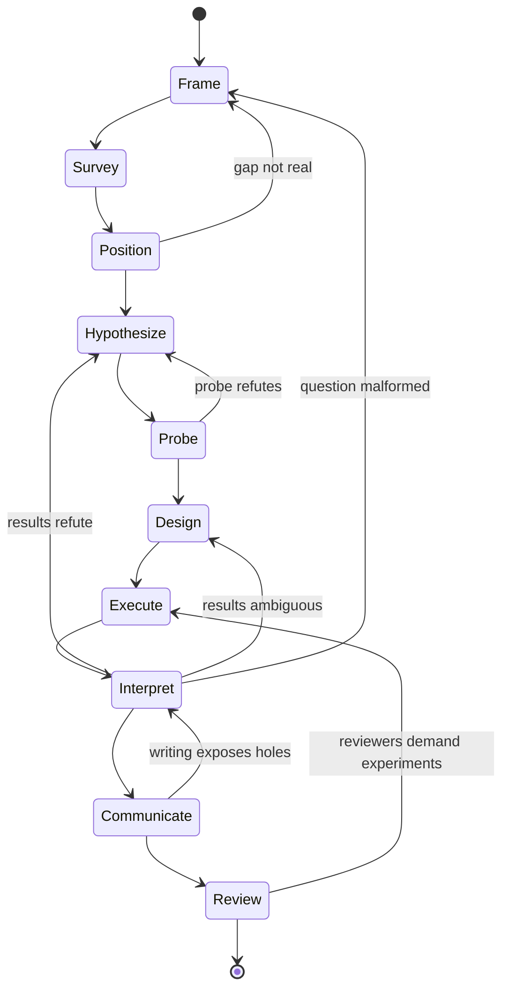

# KagamiOS — State Machine

This document first critiques the founding pipeline from `questions.md`, then proposes the replacement design: a two-layer state machine (portfolio + project) with first-class loop transitions, and a discussion of an alternative model in which artifacts, not the project, carry the state.

---

## 1. Critique of the founding pipeline

The proposal:

> Idea → Research Questions → Research Targets → Literature Survey → Historical Narrative → Current Research Landscape → Research Gaps → Hypotheses → Experiment Design → Implementation Plan → Paper Draft

### 1.1 Structural problems

**It is a waterfall, and research is not.** All ten arrows point forward. But the single most common event in real research is a *backward* transition: an experiment refutes the hypothesis; a survey pass reveals the question was malformed; writing the introduction exposes that the gap is not a gap. In software, waterfall is risky; in research it is definitionally wrong — an experiment whose outcome you can guarantee is not an experiment. A state machine that cannot represent its most frequent transition will be abandoned on first contact with a negative result. (Principle P2.)

**It has no kill state.** Every idea that enters this pipeline exits as a paper draft. In reality, a healthy research process kills most ideas — the earlier the better — and the kill decision is the highest-leverage decision in the whole process. The machine needs terminal states other than "published," and a portfolio layer above the pipeline to manage many competing bets. (Principle P10, `vision.md` Reframe 2.)

**It jumps from hypothesis to full commitment.** Hypotheses → Experiment Design → Implementation Plan interposes nothing between "I believe X" and "here is the full experimental program." Real researchers run cheap probes first — a toy-data script, a napkin calculation, one email to someone who tried it. The absence of a pilot stage is the pipeline's most expensive omission. (Principle P6.)

**Survey is modeled as a stage, but it is a background process.** Literature monitoring never stops: a relevant paper can appear at any point and invalidate the Gap Register or scoop the hypothesis. Modeling survey as a one-time stage means the system's model of the literature is frozen at week three. Survey must be a *continuous process* with a triggering role (it can force re-review of downstream artifacts), plus an intensive burst early on.

**The paper is terminal.** Deferred to `vision.md` Reframe 3 and Principle P8: the paper skeleton should exist from the Hypothesize stage, and the machine should not end at "draft" — review, rebuttal, revision, and the spawning of follow-up ideas are real states where real work happens.

### 1.2 Stage-by-stage challenges

- **Idea → Research Questions → Research Targets.** Three states with unclear boundaries. What artifact distinguishes a "target" from a "question"? Merged here into one **Frame** state producing a Question Hierarchy. Also: `questions.md` assumes research begins with an intuition about a technique; that is one entry mode of at least five (Principle P11).
- **Historical Narrative.** Challenged as a *required* stage. A historical narrative is genuinely valuable for survey papers and for building deep intuition in a mature field, but for many projects a landscape map suffices, and writing good history is expensive. Demoted to an *optional artifact* of the Survey process, produced on demand — not a state every project passes through. If dogfooding on the Signature project shows it earns its cost, revisit.
- **Research Gaps.** Kept, but the stage's hard question is missing from the proposal: **why does this gap exist?** Every gap has one of four explanations — it is hard, it is uninteresting, it is impossible, or it is already filled and you missed the paper. Naive gap-finding (especially LLM gap-finding) skips this question and produces gaps of types 2–4. The gap artifact hard-codes it (see `artifacts.md`).
- **Hypotheses.** Kept, pluralized. One hypothesis is advocacy; the stage must produce competing hypothesis cards with falsification criteria (Principle P5).
- **Experiment Design / Implementation Plan.** Kept, merged and lightened. The strongest real-world analogue is **preregistration** (OSF, registered reports): success metrics, baselines, and analysis decided *before* running, which is exactly the discipline an AI-drafted design can cheaply provide. A separate "Implementation Plan" state is software-brain; in ML research the implementation plan is a section of the experiment design.
- **Missing entirely:** Execute (running experiments is where months go — the pipeline doesn't model it), Interpret (deciding what results mean is a distinct, judgment-heavy activity, and the stage where self-deception happens), and everything after submission.

---

## 2. The two-layer design

### 2.1 Portfolio layer

Manages ideas as bets. Deliberately tiny.

```
CAPTURED ──▶ TRIAGED ──▶ ACTIVE ──▶ GRADUATED (published / handed off)
    │            │          │
    └────────────┴──────────┴──▶ DORMANT ◀──▶ (revivable, with conditions)
                            │
                            └──▶ KILLED (with Kill Memo)
```

| State | Meaning | Artifact | Human gate |
|---|---|---|---|
| CAPTURED | Raw intuition recorded, zero vetting | Intuition Note | none — capture must be frictionless |
| TRIAGED | Passed a minutes-scale Heilmeier screen | Triage Memo | **Pursue / park / drop** (constitutive — P3) |
| ACTIVE | Running the project-layer machine | (project artifacts) | ongoing |
| DORMANT | Parked with explicit revival conditions | updated Triage Memo | revive decision |
| KILLED | Dead, with a written cause of death | Kill Memo | **kill decision** (constitutive — P3) |
| GRADUATED | Published or handed off; spawns new CAPTURED ideas | final Paper + spawn notes | — |

The AI's portfolio-layer jobs: draft Triage Memos, periodically re-check DORMANT bets against new literature ("the revival condition for bet #7 may now hold"), and flag ACTIVE bets whose upstream assumptions have gone stale.

### 2.2 Project layer

States for a single ACTIVE bet. Solid arrows = nominal flow; the loop-back table below is equally normative.



Survey is drawn as a state (its intensive burst) but runs as a background process for the project's whole life; its alerts can mark any downstream artifact stale (P7).

### 2.3 State table

| State | Input | Output artifacts | AI does | Human decides | Exit criteria (validation) |
|---|---|---|---|---|---|
| **Frame** | Intuition Note, Triage Memo | Question Hierarchy (RQ + subquestions + assumptions) | draft question decompositions; attack each question ("answerable? already answered? interesting if answered?") | which questions are *worth* answering (P3) | each RQ has a conceivable answer-shape and a reason someone would care |
| **Survey** (burst + continuous) | Question Hierarchy | Survey Corpus, Landscape Map; *optional:* Historical Narrative | search, dedupe, summarize, build citation graph, tag papers to RQs; continuous monitoring alerts | which threads to read deeply; when coverage is "enough" | landscape map reviewed; key papers read by human, not only summarized |
| **Position** | Landscape Map | Gap Register | enumerate candidate gaps; **adversarially test each**: why does this gap exist? who is closest to filling it? | which gaps are real and worth taking (taste, P3) | every surviving gap has a written answer to "why does it exist" |
| **Hypothesize** | Gap Register | Hypothesis Cards (plural, competing); Paper Skeleton v0 | draft cards, propose alternatives, derive falsification criteria; draft skeleton | commit to a hypothesis set; author the one-line core claim personally | ≥2 live alternatives OR written justification for one; each card has a falsifier |
| **Probe** | Hypothesis Cards | Pilot Report | scaffold toy experiments, run sanity checks, estimate costs | **kill / pivot / proceed** (constitutive — P3) | probe was actually cheap (timeboxed); verdict recorded either way |
| **Design** | surviving Cards, Pilot Report | Experiment Design (preregistration-style, incl. implementation plan) | draft full design: baselines, metrics, ablations, success/failure criteria ex ante; red-team it ("what would a reviewer demand?") | approve the design; sign off on ex-ante success criteria | success/failure criteria written *before* execution; discriminates between live hypotheses (P5) |
| **Execute** | Experiment Design | Run Log (lab notebook), results data | bookkeeping, run tracking, anomaly flagging, deviation-from-design alerts | respond to surprises; approve design deviations (logged) | every run traceable to the design or to a logged deviation |
| **Interpret** | Run Log, results | Interpretation Memo; updated Hypothesis Cards; Claim Graph updates | draft alternative explanations for the results, incl. boring ones (bugs, leakage, seed variance); check claims against evidence | what the results *mean*; which hypotheses survive | each claim in the memo links to evidence; alternative explanations addressed, not just listed |
| **Communicate** | Paper Skeleton, Claim Graph | Paper draft, submission | draft prose from artifacts; verify every claim has an evidence link; format/citation mechanics | claim strength — what to assert and how hard (constitutive — P3) | no claim without a Claim Graph edge; human has read every sentence |
| **Review** | reviews/rebuttals | Rebuttal, revisions; spawned Intuition Notes | summarize reviews, draft rebuttal skeleton, diff requested vs. done | how to respond; what to concede | — |

Skipping a state is allowed with a one-line waiver (P9); entering mid-machine backfills minimal upstream artifacts (P11).

---

## 3. Alternative model: artifacts carry the state

There is a serious argument that a *project-level* state machine is the wrong abstraction entirely. Real projects are rarely "in" one state: you are executing one experiment while re-surveying for a second hypothesis and already writing the intro. A cleaner model:

- Each **artifact** has a status lifecycle: `draft → reviewed → accepted → (stale | superseded)`.
- Dependencies form a graph; staleness propagates along it (P7).
- The "current state" of the project is *derived*: the frontier of the artifact graph — which artifacts are accepted, which are stale, which are missing. "Ready to Design" simply *means* "some Hypothesis Card is accepted and not stale."

This is `make` for research: human sign-offs are pinned nodes, AI regenerates drafts of whatever is buildable, and nothing is ever "in a phase."

**Trade-off.** The artifact-graph model is more truthful but offers no narrative spine — no answer to "what should I do next?", which is exactly what a researcher drowning in an open-ended project needs, and what makes BMAD feel like an operating system rather than a wiki.

**Decision: hybrid.** Artifact statuses and staleness propagation are the *ground truth* (the kernel). The project-layer states of §2.2 are a *view* over that graph plus a recommended nominal ordering — the scheduler, not the memory. This mirrors BMAD precisely: BMAD's real mechanism is document handoffs; its phases are the choreography on top.
