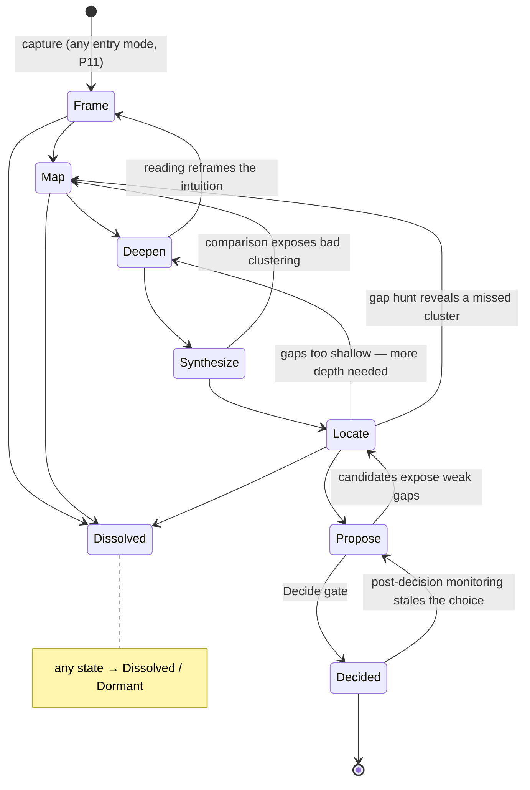

# KagamiOS v2 — The Discovery State Machine

This document answers request #10 first — *what kind of abstraction is Discovery?* — because the answer determines what the "state machine" even is. Then it specifies the states, gates, loop-backs, terminals, and stopping mechanics.

---

## 1. What abstraction is Discovery?

`2_questions.md` offers four candidates: a state machine, an artifact graph, an elicitation loop, or something else. Each alone fails:

- **A pure state machine** over-linearizes. Discovery genuinely interleaves (you deepen one cluster while still mapping another), and the most important transitions are triggered by *what you learn*, not by finishing a phase. v1 already hit this (its §3) and demoted states to a view.
- **A pure artifact graph** is truthful but directionless — it answers "what exists and what is stale" but not "what should happen next," and a researcher facing an unbounded literature needs the second answer more. This was v1's objection too, and it is stronger in discovery, where the work (reading) is infinitely extensible.
- **A pure elicitation loop** knows what to ask but not where it is going. Without a notion of stages it cannot enforce generation windows (E6), cannot say "you have enough map to start deepening," and cannot terminate.

**Decision: a three-part hybrid, with the emphasis shifted from v1.**

| Part | Role | What it owns |
|---|---|---|
| **Artifact graph** | the *memory* | ground truth, dependencies, staleness (incl. `elicited_from` edges to ledger answers) |
| **Elicitation loop** | the *engine* | scheduling: next artifact → unknowns → triage → compute or ask (`elicitation.md` §2) |
| **State machine** | the *map* | nominal ordering, generation windows, gate placement, budgets, termination |

v1's hybrid was graph-as-kernel + states-as-scheduler. v2 inserts the elicitation loop as the scheduler and demotes states one further notch: states are milestones the loop steers by, not phases the project is "in." Concretely, "the project is in Deepen" means "the frontier artifacts are Cluster Dossiers" — a derived fact, and different clusters may be in different states simultaneously. The states earn their keep in exactly three ways: they order the nominal flow, they anchor the generation windows, and they place the human gates.

## 2. The machine

Terminal states: **Decided** (Direction Decision signed — the handoff), **Dissolved** (the intuition doesn't survive scrutiny; Dissolution Memo written — a *success*, P10), **Dormant** (parked with revival conditions; the monitoring config keeps watching).

Mapping to the eleven-step workflow in `2_questions.md`:

| Workflow step | State |
|---|---|
| Clarify the intuition through targeted elicitation | **Frame** |
| Identify related areas · cluster into groups · identify researchers/communities | **Map** |
| Understand each group's history · read representative papers | **Deepen** |
| Compare competing approaches · understand current trends | **Synthesize** |
| Identify research gaps | **Locate** |
| Generate candidate directions | **Propose** |
| Human selects a direction | **Decide** (gate) |

## 3. State table

"Questions" lists the leverage classes typically exercised (`elicitation.md` §3). Bold human decisions are the **constitutive triad** (P3-adapted): scope & attention, gap meaningfulness, selection.

| State | Input | Output artifacts | AI does | Questions | Human decides | Exit criteria |
|---|---|---|---|---|---|---|
| **Frame** | Intuition Note (any entry mode) | Inquiry Frame; Confidence Checklist v0; Researcher Profile (delta) | records unprimed hunch (E6); shallow orientation pass; drafts frame + checklist; enumerates readings of the intuition | L1; unprimed hunch; constraints | **scope**: which readings of the intuition are in play; hard constraints | frame reviewed; checklist drafted; scope boundaries explicit |
| **Map** | Inquiry Frame | Field Map (clusters, relations, communities, key people); depth budgets | search; cluster the field; draft cluster cards; identify recurring groups/lineages; propose budgets | L2, L4 | **attention**: clusters in/out; reading-priority ranking; budget sign-off | every in-scope cluster has a card the human edited or confirmed; budgets set |
| **Deepen** | Field Map, budgets | Cluster Dossiers (per in-scope cluster: evolution, representative papers, people/venues, frontier) | drafts dossiers; proposes representative sets; summarizes non-representative papers; tracks budget burn | L3, L4; scope-extension confirms | which papers *they* read (with logged reactions); swap representatives; extend/stop per budget | per cluster: dossier reviewed AND representative papers `human_read` |
| **Synthesize** | accepted Dossiers | Landscape Synthesis (competing-approaches matrix, trends, solved/open table) | builds comparison matrix; extracts trends; drafts solved/open with evidence links | mostly review-as-elicitation; weighting confirms | approve the comparison frame; confirm weightings | matrix reviewed; every "open" entry has evidence of openness, not just absence |
| **Locate** | Landscape Synthesis | Gap Register | enumerates candidate gaps; adversarially screens each (`why_does_this_gap_exist` — v1 mechanism, kept verbatim) | L5 | **gap meaningfulness**: mark each gap meaningful-to-me / real-but-not-mine / suspicious | every surviving gap has an existence-explanation and a human meaningfulness mark |
| **Propose** | Gap Register, Researcher Profile | Candidate Direction cards (plural, competing — P5) | *(generation window opens here)* records unprimed lean first (E6); generates candidates from accepted gaps only; drafts fit-to-profile notes; red-teams each candidate | L6; unprimed lean | add own candidates; strike candidates; demand more evidence | ≥2 live candidates or written justification for one; each cites gaps + human-read papers |
| **Decide** *(gate)* | Candidate cards | Direction Decision (incl. why-this-over-others, parked candidates with revival conditions); handoff bundle | drafts the decision memo skeleton; runs Confidence Checklist against traces; diffs choice vs. unprimed lean | L6 | **selection** — human-only, the terminal act | checklist trace-complete; comparison written; decision signed |

Skipping a state requires a one-line waiver (P9). Entering mid-machine backfills a minimal Intuition Note and Inquiry Frame so the graph is rooted (P11).

## 4. Human decision points, consolidated (request #3)

**Constitutive (human-only fields, never AI-writable):**
1. **Scope & attention allocation** — Frame's in-scope readings; Map's cluster in/out and priority ranking; depth budgets. This is taste about *interest*, the discovery analogue of v1's problem selection.
2. **Gap meaningfulness** — Locate's per-gap mark. An AI can argue a gap is real; only the researcher knows whether it is *theirs*.
3. **Direction selection** — the Decide gate, including the written comparison. The endpoint is the researcher's confidence; a delegated selection is a category error.

**Review gates (loosenable with trust):** Field Map acceptance, Dossier acceptance, Synthesis acceptance, candidate red-team review.

**Standing human obligations (not gates):** reading representative papers (`human_read` + reaction — E7); answering or explicitly skipping question cards; the two unprimed E6 answers.

## 5. Stopping: budgets and the convergence test

Discovery's characteristic failure is not wrong transitions but *no termination* — the survey rabbit hole. Two mechanisms force convergence:

- **Depth budgets.** Set at Map exit (human-owned, revisable): clusters to deepen, papers to human-read per cluster, a soft time horizon. When a budget exhausts, the system asks a rent-paying question: "extend cluster 2 by N papers, or proceed with what we have?" — leverage L6, because the answer changes what candidates can be supported.
- **The checklist as convergence test.** The Confidence Checklist (drafted at Frame) is re-scored at every gate. When remaining unfilled entries can only be filled by *choosing* (not by more reading), the system says so explicitly: "further reading no longer changes the candidate set — the next action is Decide." This is the anti-survey-tool mechanism in one sentence.

## 6. After Decided

KagamiOS's job ends at the handoff, but not abruptly: the monitoring config (queries, venues, authors from the Field Map) keeps running. If a new paper fills the chosen gap or a parked candidate's revival condition fires, the *Direction Decision itself* is marked stale and the researcher is alerted — the one post-terminal obligation the system retains. What consumes the handoff bundle (a v1-style lifecycle machine, a plain human process, a downstream agent) is outside the boundary, by design.
