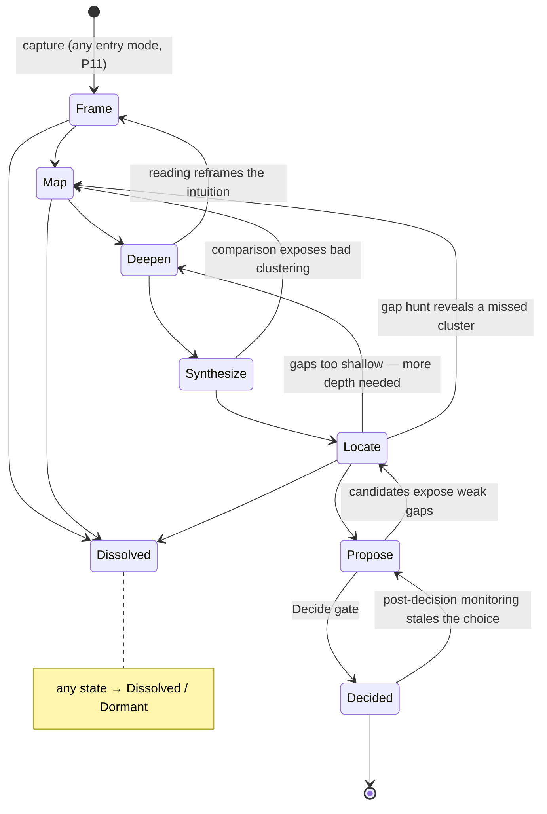

# 03 — The Discovery State Machine

## 1. What kind of abstraction Discovery is

A three-part hybrid:

| Part | Role | Owns |
|---|---|---|
| **Artifact graph** | the *memory* | ground truth, pinned dependencies, staleness (including `elicited_from` edges to ledger answers) |
| **Elicitation loop** | the *engine* | scheduling: next artifact → unknowns → triage → compute or ask (`05_elicitation.md` §2) |
| **State machine** | the *map* | nominal ordering, generation windows, gate placement, budgets, termination |

States are milestones the loop steers by, not phases the project is "in." "The project is in Deepen" is a **derived fact** (§5); different clusters may be in different states simultaneously. States earn their keep in exactly three ways: they order the nominal flow, they anchor the generation windows (E6), and they place the human gates.

## 2. The machine

**Terminals:** **Decided** (Direction Decision signed — the handoff), **Dissolved** (the intuition doesn't survive scrutiny; Dissolution Memo written — a success, P10), **Dormant** (parked with revival conditions; monitoring keeps watching).

Every loop-back transition carries a one-line cause annotation (P2), emitted as a `state_transition` event (`08_observability.md`). Skipping a state requires a one-line waiver (P9). Entering mid-machine backfills a minimal Intuition Note and Inquiry Frame so the graph is rooted (P11).

## 3. State table

"Questions" lists the leverage classes typically exercised (`05_elicitation.md` §3). Bold human decisions are the constitutive triad (P3). Read-sets per state are specified in `07_runtime.md` §3.

| State | Input | Output artifacts | AI does | Questions | Human decides | Exit criteria |
|---|---|---|---|---|---|---|
| **Frame** | Intuition Note (any entry mode) | Inquiry Frame; Confidence Checklist v0; Researcher Profile (delta) | records unprimed hunch (E6); shallow orientation pass; drafts frame + checklist; enumerates readings of the intuition | L1; unprimed hunch; constraints | **scope**: which readings are in play; hard constraints | frame reviewed; checklist drafted; scope boundaries explicit |
| **Map** | Inquiry Frame | Field Map (clusters, relations, groups/people as entities, venues, recency profiles); depth budgets | searches (incl. preprints, code, workshops); computes candidate partitions (E8) and drafts cluster cards — offering an alternative cut (`06_roles.md` Cartographer); identifies recurring groups/lineages; proposes budgets | L2, L4 | **attention**: clusters in/out; reading-priority ranking; cluster naming; budget sign-off | every in-scope cluster has a card the human edited or confirmed; budgets set |
| **Deepen** | Field Map, budgets | Cluster Dossiers (one per in-scope **topical cluster**; groups appear as entities within — M3) | drafts dossiers in parallel per cluster (`07_runtime.md` §7); proposes representative sets; one-line summaries for non-representatives; tracks budget burn | L3, L4; scope-extension confirms | which papers *they* read (with logged reactions); swap representatives; extend/stop per budget | per cluster: dossier reviewed AND representative papers `human_read` |
| **Synthesize** | accepted Dossiers | Landscape Synthesis (competing-approaches matrix, trends, solved/open table) | builds comparison matrix; extracts trends; drafts solved/open with evidence links | mostly review-as-elicitation; weighting confirms | approve the comparison frame; confirm weightings | matrix reviewed; every "open" entry has evidence of openness, not just absence |
| **Locate** | Landscape Synthesis | Gap Register | enumerates candidate gaps; adversarially screens each (`why_does_this_gap_exist`); admits micro-probe evidence for feasibility claims (`04_artifacts.md`) | L5 | **gap meaningfulness**: mark each gap meaningful-to-me / real-but-not-mine / suspicious | every surviving gap has an existence-explanation and a human meaningfulness mark |
| **Propose** | Gap Register, Landscape Synthesis, Researcher Profile | Candidate Direction cards (plural, competing — P5) | *(generation window opens)* records unprimed lean first (E6); generates candidates from accepted gaps **and/or** synthesis evidence — transplants, why-now/capability-overhang candidates (S1); drafts fit-to-profile notes; red-teams each candidate in parallel | L6; unprimed lean | add own candidates; strike candidates; demand more evidence | ≥2 live candidates or written justification for one; each cites its evidence + human-read papers |
| **Decide** *(gate)* | Candidate cards | Direction Decision (portfolio-structured, `04_artifacts.md`); handoff bundle | drafts decision-memo skeleton; runs Confidence Checklist against traces; diffs choice vs. unprimed lean; harvests rejection reasons from red-team notes | L6 | **selection** — human-only, the terminal act; writes "why this over the others" | checklist trace-complete; comparison written; per-candidate disposition recorded; decision signed |

## 4. Human decision points, consolidated

**Constitutive (fields declared `author: human`; the store rejects AI writes — `07_runtime.md` §1):**
1. **Scope & attention allocation** — Frame's in-scope readings; Map's cluster in/out, naming, and priority ranking; depth budgets.
2. **Gap meaningfulness** — Locate's per-gap mark.
3. **Direction selection** — the Decide gate, including the written comparison.

**Review gates:** Field Map acceptance, Dossier acceptance (per cluster), Synthesis acceptance, candidate red-team review. Gates are *loosenable with trust*: the system may propose collapsing a review gate to a notification, grounded in the researcher's own aggregated edit statistics, and only with the researcher's approval (`08_observability.md` §1). Gates never loosen silently, and the constitutive triad never loosens at all.

**Standing obligations (not gates):** reading representative papers (`human_read` + reaction, E7); answering or explicitly skipping question cards; the two unprimed E6 answers.

## 5. The derived-state function and the run manifest

Each run has a **run manifest** (`04_artifacts.md` §3): run id, rooting Intuition Note, budget counters, monitoring config, and derived state.

**Derived-state function (normative):** a cluster's state is the earliest state whose exit criteria (§3) it has not met. The run's nominal state is the modal cluster state. **Generation windows and gate placement key off per-cluster state, not run state** — a dossier may be drafted for cluster 1 while cluster 2 is still being mapped, but no candidate content may be generated anywhere until the Gap Register (a run-level artifact) is accepted.

## 6. Stopping: budgets and the convergence test

Discovery's characteristic failure is non-termination — the survey rabbit hole. Two mechanisms force convergence; both are **advisory, never auto-enforced**:

- **Depth budgets.** Set at Map exit (human-owned, revisable): clusters to deepen, papers to human-read per cluster, a soft time horizon. Budget exhaustion raises a rent-paying question ("extend cluster 2 by N papers, or proceed?" — leverage L6). Every extend-or-proceed answer is logged, and whether extensions changed the candidate set is computed post-hoc (`08_observability.md`) — the dataset a better stopping rule needs.
- **The checklist as convergence test.** The Confidence Checklist is re-scored at every gate. When remaining unfilled entries can only be filled by *choosing*, the system says so explicitly: "further reading no longer changes the candidate set — the next action is Decide."

## 7. After Decided

The monitoring config (queries, venues, authors, entities from the Field Map and entity registry) keeps running. If a new paper fills the chosen gap or a parked candidate's revival condition fires, the Direction Decision itself is marked stale and the researcher is alerted — the one post-terminal obligation. A staling alert reopens the old run at the affected state; a *new* intuition is a new run (new Intuition Note, shared Researcher Profile and entity registry, citable prior artifacts). What consumes the handoff bundle is outside the boundary, by design.
